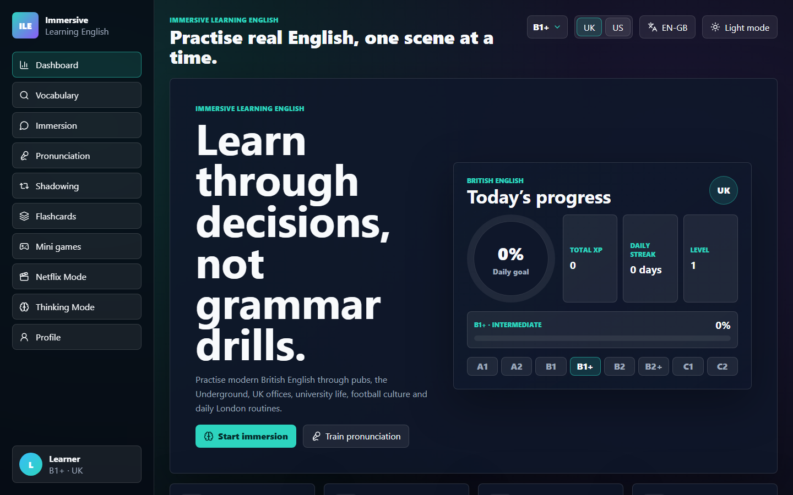
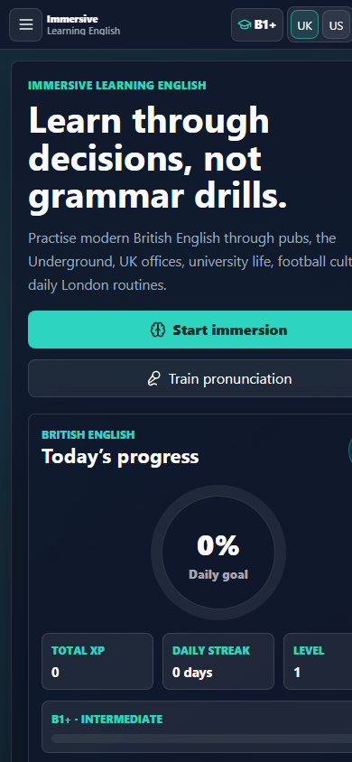
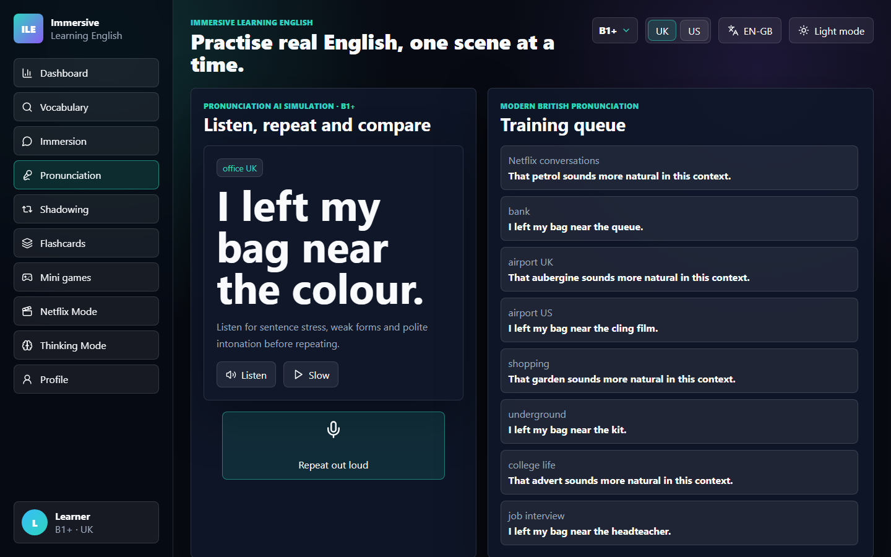

# Immersive Learning English

[](https://github.com/DegsTerin/immersive-learning-english/actions/workflows/quality.yml)
[](LICENSE)

Immersive Learning English is a static, installable web app for practising English through real situations rather than grammar drills. It separates **British English** and **American English** into independent study paths, with different vocabulary, accent training, cultural notes, idioms and interactive scenes.

The interface is available in **Portuguese (Brazil)** and **UK English**. All English interface copy uses British spelling, such as **colour**, **favourite**, **organise**, **centre** and **travelling**. American spelling is used only inside the American English study path.



## Highlights

- Independent **British English** and **American English** modes.
- CEFR placement check before onboarding: A1, A2, B1, B1+, B2, B2+, C1 and C2.
- Guided **Daily Path**: review, pronunciation, immersive scene and mini game.
- Dashboard with XP, levels, streaks, daily goals, history, calendar, achievements and local ranking.
- Multiple local learner profiles with isolated progress, study level, flashcards, history and JSON portability.
- Accessibility controls for font size, high contrast and reduced motion.
- Real recorded starter audio pack for selected UK/US vocabulary, with Web Speech API fallback.
- Pronunciation practice with speech recognition, scoring, phonetic focus, minimal pairs, rhythm and intonation feedback.
- Smart flashcards with spaced repetition, favourites and difficult-word tracking.
- Mini games: Listening Challenge, Speed Vocabulary, Accent Challenge, Complete the Sentence, Interactive Dialogue and Memory Game.
- Netflix English Mode with cinematic dialogue choices and naturalness feedback.
- Thinking in English Mode for fast, non-translation responses.
- PWA support, offline cache, install prompt compatibility and “new version available” notification.
- Static deployment target for GitHub Pages using a built `gh-pages` branch.

## Screens

| Mobile study view | Pronunciation lab |
| --- | --- |
|  |  |

## Learning Model

The app is built around **Immersive Learning English**: learners make decisions inside realistic situations, hear native-style language, compare cultural fit and practise speaking with immediate feedback.

The learning flow prioritises:

- conversation in context;
- listening and shadowing;
- pronunciation and rhythm;
- active recall;
- cultural appropriateness;
- thinking directly in English;
- practical fluency over isolated grammar rules.

## Study Paths

### British English

Focused on modern British pronunciation, UK spelling and everyday UK contexts:

- pubs;
- the Underground;
- UK airports;
- UK office communication;
- university life;
- football culture;
- daily London routines.

### American English

Focused on General American pronunciation, US vocabulary and everyday US contexts:

- coffee shops;
- corporate meetings;
- college life;
- US airports;
- Netflix-style conversations;
- the tech industry;
- daily small talk.

## Audio Packs

The app now supports local recorded audio packs. When a registered recording exists, the Listen button plays the real recorded file. When no recording exists yet, the app falls back to browser speech synthesis, so content coverage remains complete.

Starter recorded files are stored in:

```text
public/audio/en-GB/
public/audio/en-US/
```

Current starter recordings:

- UK: `flat`
- US: `apartment`, `color`, `vacation`

Attribution is documented in [public/audio/ATTRIBUTION.md](public/audio/ATTRIBUTION.md). The starter files come from Wikimedia Commons/Shtooka and use Creative Commons licences.

To add more real recordings:

1. Place `.ogg`, `.mp3` or `.wav` files under `public/audio/en-GB/` or `public/audio/en-US/`.
2. Register each file in [src/data/audioPacks.js](src/data/audioPacks.js).
3. Add creator, licence and source details to [public/audio/ATTRIBUTION.md](public/audio/ATTRIBUTION.md).
4. Add high-priority offline files to `APP_SHELL` in [public/service-worker.js](public/service-worker.js).

## Content

The local content database includes:

- 500 British English vocabulary entries;
- 500 American English vocabulary entries;
- 300 real-life phrase prompts;
- 100 UK idioms;
- 100 US idioms;
- 50 interactive scenarios;
- curated comparison seeds with contextual variations.

The dataset is fully static and can be expanded without a backend.

## Tech Stack

- HTML5
- CSS3
- JavaScript ES6+
- React
- Vite
- Web Speech API
- localStorage
- Service Worker
- PWA manifest
- GitHub Pages

## Project Structure

```text
src/
  assets/       visual assets
  audio/        reserved for source-managed audio helpers
  components/   reusable UI components
  data/         vocabulary, scenarios, idioms, audio manifests and CEFR data
  hooks/        progress state and local persistence
  pages/        app screens
  styles/       global responsive CSS
  utils/        speech, games, daily path and storage utilities
public/
  audio/        recorded audio pack served as static files
  icons/        PWA icons
  manifest.webmanifest
  service-worker.js
docs/
  images/       README screenshots
```

## Local Development

```bash
npm install
npm run dev
```

Open the local Vite URL shown in the terminal.

## Quality Checks

```bash
npm run lint
npm run test
npm run build
```

The test suite covers:

- streak logic across local calendar days;
- daily path progression;
- UK/US content filtering;
- game option integrity;
- CEFR placement scoring;
- recorded audio pack resolution;
- phonetic feedback;
- mobile layout safeguards;
- profile portability and import/export logic;
- service worker update flow.

## GitHub Pages Deployment

This repository is published through GitHub Pages using the built `gh-pages` branch. The `Quality` workflow validates linting, tests and production builds on pull requests and changes to `main`; publishing remains an explicit `gh-pages` branch operation.

Live site:

[https://degsterin.github.io/immersive-learning-english/](https://degsterin.github.io/immersive-learning-english/)

Repository settings:

1. Go to **Settings > Pages**.
2. Select **Deploy from a branch** as the source.
3. Select branch `gh-pages`.
4. Select folder `/`.

Deployment flow:

1. Run the quality checks locally.
2. Run `npm run build`.
3. Publish the generated `dist/` output to the `gh-pages` branch.

The Vite config uses `base: './'`, so the app works correctly in GitHub Pages subpaths.

The quality workflow intentionally does not deploy, so a successful check cannot overwrite the published site.

## Privacy

Progress is stored locally in the user’s browser through `localStorage`. There is no required backend and no required account system.

## Licence

Application code is released under the MIT Licence. See [LICENSE](LICENSE).

Recorded audio files keep their original Creative Commons licences. See [public/audio/ATTRIBUTION.md](public/audio/ATTRIBUTION.md).
